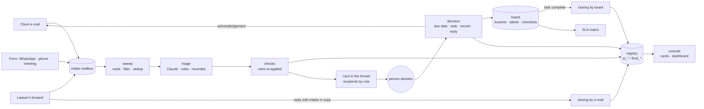

# legal-intake-triage

The front door of a law firm's practice areas. A demand arrives by e-mail (the area's mailbox, a lawyer's forward, or the e-mail a form sends for WhatsApp, phone and meeting requests); deterministic filters drop the noise and deduplicate the thread; a language model prepares a decision package (client, work type, summary, suggested lawyer, complexity, deadline, a reply draft); a person approves it on a card in the demand's own thread; and the approval, not the model, creates the task in the client's bucket, the row in the master record with the suggestion and the decision side by side, and the acknowledgement to the client. Closing has two paths and the dashboard measures both. Built for a firm's business-advisory and corporate teams on Power Automate and Microsoft 365; rebuilt here as code with adapters, an offline demo and the rules the flow only described.

 

**Status:** the original is in production in two practice areas since July and September 2026; this is its coded rebuild · **Runs offline:** yes, the demo needs no key, no tenant and no network

```
$ uv run intake --demo sweep
Sweep of 2026-09-21 | mode: DEMO | messages=14 already_processed=0 skipped=3 duplicates=2 closed=1 registered=8 failed=0
  skipped:    Reunião de alinhamento da área — quinta: internal message that is not a forward
  skipped:    Boletim semanal: novidades legislativas: auto-generated sender
  skipped:    Resposta Automática: fora do escritório: automatic reply
  closed:     d-seed-1 closed by the reply of carla.mendes@lawfirm.example
  card:       d-0f44ab69 -> bruno.costa@lawfirm.example  (Revisão de contrato de fornecimento — Construtora Exemplo)
  card:       d-634ff991 -> ana.ribeiro@lawfirm.example, bruno.costa@lawfirm.example  (Elaboração de contrato de prestação de serviços)
  card:       d-8ddef8e8 -> bruno.costa@lawfirm.example  (ENC: Notificação de inadimplência — Loja Fictícia)
  card:       d-6b6eb101 -> diego.souza@lawfirm.example  ([Forms/WhatsApp] Demanda registrada por diego.souza@lawfirm.example)
  card:       d-e68250dc -> ana.ribeiro@lawfirm.example, bruno.costa@lawfirm.example  (Oferta imperdível de software jurídico)
  card:       d-3cb294d4 -> ana.ribeiro@lawfirm.example  (URGENTE: audiência amanhã — processo nº 0001234-31.2099.8.26.0100)
  card:       d-13aeee51 -> igor.lima@lawfirm.example  (ENC: Acordo de sócios — Holding Beta)
  card:       d-b254e964 -> helena.duarte@lawfirm.example  (Alteração do contrato social — Gama Serviços)

$ uv run intake --demo decide d-0f44ab69 --approve --by bruno.costa@lawfirm.example
d-0f44ab69: approved by bruno.costa@lawfirm.example -> task task-eb1eb07cb64b due 2026-09-28 (draft to advisory@lawfirm.example)

$ uv run intake --demo decide d-0f44ab69 --discard --by ana.ribeiro@lawfirm.example
d-0f44ab69: already decided by bruno.costa@lawfirm.example

$ uv run intake --demo sweep
Sweep of 2026-09-21 | mode: DEMO | messages=14 already_processed=14 skipped=0 duplicates=0 closed=0 registered=0 failed=0
```

The fixture mail is Portuguese because the firm's mail is; the product, the prompts, the console and the docs are English. Every person, company, address and case number in the demo is invented.

## The problem

A practice area receives demands everywhere: the team's mailbox, each lawyer's personal inbox, WhatsApp, a phone call, a meeting. Someone had to read each one, work out which client it was, what kind of work it asked for, who should take it and by when, answer the client, open a task and, weeks later, know whether the client had been answered at all. The head of the area wanted one door, a decision that takes a click instead of a paragraph of typing, a task that is born complete, and numbers: how much of what the assistant suggested the head had to change, how long a demand waited for a decision, how many clients were answered the same day.

## What it does

- Reads one intake mailbox for every area, routes each message by the area address it carries, drops auto-replies and notifications, treats internal mail as a demand only when it forwards one (or when the form's flow relays a WhatsApp, phone or meeting request), and never opens a second demand for the same conversation.
- Prepares the decision package with one model call per demand: client and confidence against the area's directory, work type from the area's taxonomy, an executive summary, the suggested lawyer with the rule behind it (portfolio owner, then the forwarding lawyer, then the lowest current load on the board), complexity, business days, any explicit deadline in the text, and a reply draft in the firm's tone with a marker where the date goes. The code re-applies the rules to the answer and notes every correction on the card.
- Sends the card as a reply in the demand's own thread to the people the rules name (the client's lead, the heads, the forwarding lawyer, the form's responder), and never outside the firm; the same decision is available as a form in the console.
- On approval, and only then: computes the due date in business days with the state's holidays, creates the task in the client's bucket with the type's label and checklist, records the suggestion and the decision side by side, and sends the acknowledgement to the original sender when the area allows it. The first decision wins.
- Closes a demand when the lawyer answers the client in the thread with the intake account in copy (recording the real reply date) or, as a safety net, when the task is marked complete on the board; reports the adjustment rate, the time to decision, the same-day replies, the on-time closings, each lawyer's load and the share of closings that bypassed the copy rule. A quarterly job builds the standard-deadline matrix from the board's history.

## Architecture



`pipeline/intake.py` is the sweep; `pipeline/decision.py` is what an approval does; `pipeline/closing.py` holds both closing paths; `pipeline/metrics.py` computes what the console shows. Each practice area is a JSON file (`areas/`) validated by `areas.py`: mailbox, validation mode, deadline scale, taxonomy with labels and checklists, lawyers, client directory. The boundaries are interfaces with two implementations each: the mailbox (Graph, fixture inbox), the mailer (Graph, dry run, outbox on disk), the board (Planner, SQLite), the registry (SQLite), the triager (Claude, rules, recorded readings). `factory.py` is the only module that picks them.

## Design decisions

- **The orchestration became code, the platform stayed behind adapters.** The original ran as Power Automate flows: fast to build inside Microsoft 365, hard to test and impossible to publish. Here every step is a function with a test, and Planner, the mailbox and the model are adapters. Cost: two Graph adapters that the tests cannot exercise; the SQLite board carries the contract.
- **The model prepares; a person decides; the approval acts.** The decision package is a suggestion in editable fields. Nothing is created until someone clicks, and everything the click does is deterministic: business days with holidays, the task, the record, the reply. Cost: a card per demand and a human in the loop, which is the point.
- **The rules are enforced twice.** The prompt states the distribution rules, the taxonomy and the deadline scale; the code re-applies them to whatever comes back (a lawyer outside the area, an owner overridden by load, a deadline over the scale, a reply without the date marker) and writes each correction on the card. The evaluation measures a keyword baseline against the recorded readings, so the value of the model over rules is visible.
- **Recipients and reply targets are never model output.** The card goes to people computed from the directory and the forwarder, on the firm's domain by construction; the acknowledgement goes to the original sender only, and never for a demand a lawyer forwarded or registered through the form (they already talk to the client). The pilot's design review caught a card that could have reached a client; this is the fix as a rule.
- **Measure from day one.** The registry keeps every `ai_*` field beside every `final_*` field, so the adjustment rate is a query, not a survey. The real reply date exists only when the lawyer copies the intake account; the share of demands closed from the board instead is the adherence gap the dashboard shows rather than hides.
- **Idempotent by construction.** A message id is processed once, a conversation opens one demand, a sweep can run every fifteen minutes and after a missed day, and the second person to click a card is told who decided first.

## How AI was used

- **Generated:** the original flows, prompts, schemas and cards were written with an AI coding assistant during a two-month pilot (July to September 2026); this coded rebuild was produced with the same assistant, and the adapters, the rules-based baseline, the fixture inbox, the console and the test suite were introduced in the process.
- **Rewritten by me:** the routing and anti-loop rules that the pilot's incidents dictated (a forward is a demand, a plain internal e-mail is not; the form's responder gets the card; an external sender on the corporate list goes to the head); the distribution order and its enforcement in code; the two closing paths and the adherence gap; the recipient guard.
- **Validated:** 51 tests run offline over the fixture inbox on a temporary SQLite file, including the console's routes; the evaluation script checks every route and measures the baseline against the recorded readings, and the suite checks every card recipient; the SDK call shape (structured output through the schema, cached system block, thinking off) was kept from the pilot's tested request body.
- **Rejected designs:** monitoring the lawyers' personal inboxes (privacy, cost, false positives) in favour of the one-click forward; sending the acknowledgement for forwarded demands (a second contact the lawyer did not ask for); closing a demand on any internal reply in the thread (only the copy to the intake account closes it, with the real date); letting the model choose the deadline (the complexity scale does, unless the text carries a shorter one).
- **Commits:** made with an AI coding assistant; attribution trailers are omitted and AI usage is documented here.

## Evaluation

| What | Result | Set |
|---|---|---|
| Routes of the fixture inbox | 14 of 14 as designed | `scripts/eval.py` |
| Card recipients | every card goes to a lawyer of the area, never to the sender | `tests/test_storage_cards_sla.py` |
| Keyword baseline vs recorded readings | client 8/8, work type 7/8, lawyer 7/8, complexity 6/8, days 6/8 | the 8 demands of the inbox |
| Corrections the checks make to the recorded readings | 1 (a marketing e-mail with no lawyer gets the load rule) | same |
| Model accuracy on real demands | not measured here; the production metric is the adjustment rate, targeted under 20% in the pilot | — |

The recorded readings are hand-written expectations that stand in for the model in the demo; the baseline's misses (a forwarded corporate request read as a review instead of a drafting, "urgent" triggered by a word in a low-priority form) are the cases where a model earns its call.

## Cost & latency

One model call per demand: a stable system prompt per area of about five thousand characters, which is on the order of 1,200 tokens, cached after the first call, plus the message and the lawyers' load in the user turn, and a short structured answer. Cents per demand at Sonnet-tier list prices, a few seconds per call. The sweep runs every fifteen minutes on business hours and a card reaches the decider within that window (the original's flow took between thirty seconds and five minutes per card). The SLA matrix classifies board history titles with a small model through the Message Batches API, at half the price, once a quarter; the keyword rules do the same offline.

## Known failure modes

- **A lawyer writes a new e-mail to the intake address instead of forwarding.** It has no forward prefix and is dropped as internal noise; the pilot found this and the rule is a documented setting to revisit per area.
- **A client not in the directory.** The package says "Not identified" and the card offers a free-text field; the bucket is created from what the person types (matched case-insensitively, so a retyped name does not duplicate one).
- **The form's responder is not a lawyer of the area** (an intern registers a demand): the card goes to the head instead.
- **Two simultaneous approvals for the same new client** could create two buckets; rare, accepted.
- **Outlook mobile does not render the card**; the fallback text links to the console's form.
- **In the demo, only eight messages have recorded readings**; anything else is triaged by the keyword rules, and the output says so.

## Data & privacy

In production the sweep sends the sender, the subject and the body of a demand (no attachments) to the model API, in memory; the API provider does not train on API data, and the firm records the processing in its inventory. The registry and the board stay in the firm's tenant; cards go only to the firm's own addresses; the acknowledgement to the client is a text the head approved. This repository runs on fictional data only: invented people and companies on reserved `.example` domains and case numbers dated 2099 with invalid check digits. The system is decision support: a person decides every demand.

## Tests & CI

`uv run pytest` runs 51 tests offline: the filters and routes, the business-day calendar with holidays, the area configuration and its validation, the distribution rules, the three triagers (the Claude one with a fake client checking the structured-output request), the checks, the registry and the board, the card's inputs and recipients, the SLA matrix (percentiles, rules, the Batches classifier with a fake client), the sweep over the fourteen fixture messages, every decision path (as suggested, adjusted, discarded, the race, the reply modes, internal review), both closing paths, the metrics and the console's routes. CI runs lint, the tests, a check that the generated fixtures match their script, the demo walkthrough (the second sweep must send nothing, the second decision must be refused) and a gitleaks scan.

## Stack

`Python 3.12` `uv` `Pydantic` `pydantic-settings` `FastAPI` `Jinja2` `SQLite` `httpx` `MSAL` `Microsoft Graph (Mail, Planner)` `Adaptive Cards` `holidays` `Anthropic SDK (structured outputs, prompt caching, Message Batches)` `pytest` `ruff` `GitHub Actions` `Docker` `Windows Task Scheduler`

## Running locally

```bash
git clone https://github.com/fillipeml/legal-intake-triage
cd legal-intake-triage
uv sync
cp .env.example .env                     # DEMO_MODE=true
uv run intake --demo sweep               # the fixture inbox, Monday 2026-09-21
uv run intake --demo pending
uv run intake --demo decide d-0f44ab69 --approve --by bruno.costa@lawfirm.example
uv run intake --demo serve               # http://127.0.0.1:8000 (cards and dashboard)
uv run intake --demo stats
uv run python scripts/eval.py
```

For a real tenant, follow [docs/GRAPH_SETUP.md](docs/GRAPH_SETUP.md), describe each area in `areas/`, keep `DRY_RUN=true` for a few days, then schedule the sweep and the board sync (`scripts/register_scheduled_task.ps1`, or the `Dockerfile` from any scheduler).

## Demo mode

Every external system sits behind an interface with a local implementation selected only in `factory.py` by `DEMO_MODE=true`: a fixture inbox of fourteen messages that cover every route, recorded readings in place of the model (with the keyword rules as fallback), SQLite for the board and the registry, and a mailer that writes every card and reply to `.demo/outbox/`. See [docs/DEMO.md](docs/DEMO.md) for the five-minute walkthrough and [docs/FLOW.md](docs/FLOW.md) for the flow step by step.

## What I'd do next

- Record real (anonymised) demands with the heads' decisions and measure the model's package against them, field by field, the way the baseline is measured now.
- Validate the Entra token of the Outlook card's action in the console, so the card decides without the console's form.
- Add a client's conversation history to the package (the last demands of the same sender) so the summary and the lawyer suggestion carry context.

## Glossary

Operational and legal terms, and the Portuguese kept on purpose, are explained in [docs/GLOSSARY.md](docs/GLOSSARY.md).

## Licence

MIT
